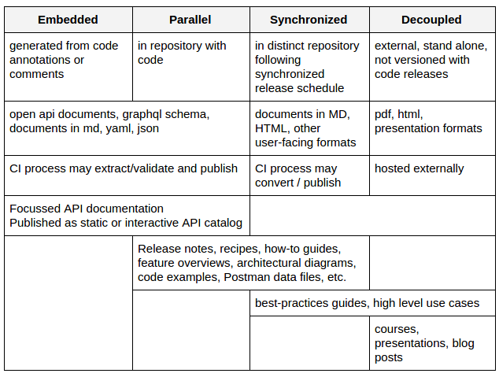

# Documentation Types and Code

One way of understanding different documentation processes and products is to consider the physical relationship between the documentation and the it documents software. In this overview we assume three core concepts of software development:

*software release management and versioning.* Software is released according to a staged process and is versioned following practices similar to the [semantic versioning guidelines](https://semver.org/spec/v2.0.0.html).

*source code repository.* Source code is persisted in a repository that supports management and version control (ex: git/github)

*continuous integration.* Source code goes through an iterative build/test/deploy process to produce distributable artifacts. These processes can be configured to run automatically on changes to codebase or be triggered as required. (ex: Jenkins, Hudson, etc.)

The table below summarizes how various types of documentation may be embedded in the code base itself, may exist alongside the code, may be in a distinct repository that is kept in sync with the code repo, or may be completely detached from the code development and release cycle. 

As we move from left to right across the table above, documentation becomes higher-level, less automated and may lag behind the software release schedule.

In consultation with development and release management, a documentation plan will include an understanding of what documentation can be derived from *embedded* elements in the code base, what documentation can live in *parallel* in the same repository, whether or not the documentation team should maintain a separate *synchronized* repository, and what existing external, *decoupled*, documentation may already exist or should be planned.

Examples of *embedded* documentation may include comments and annotations (e.g.: Javadoc, JSdoc), fragments of API schemas or documents. These are often written by development team, and may require the establishment of guidelines and review processes. In general these produce low-level API documentation (e.g.: code interfaces, REST interfaces, or graphQL schemas). As part of the CI process, these may be extracted, processed, validated, and converted into a readable format. A secondary CI process may publish these as internal static or interactive HTML.  Processes must be established for review and testing of this documentation during the code development cycle, as changes to these may require changes to source code. Because it is embedded in the source code, this type of documentation is owned by developers.

*Parallel* documentation lives with the code, perhaps in a distinct set of folders, and is versioned and released with the software. Unlike the embedded examples above, these are not generated from elements of the source code itself. There is some overlap between embedded and parallel documentation - some schemas and api docs may not be embedded in the source code and may be owned by the documentation team, rather than the dev team. This documentation may range between artifacts that require extraction and conversion through some CI process, and those already in human-readable format. Release notes, for example, should be considered for inclusion in this category. 

It may not be feasible for all (or any) documentation to be in the same repository as the source code itself. It is still important to tread “documentation as code” and keep it in a repository and version, release, and test it, following a release schedule that is *synchronized* with the software release schedule. A distinct repository may be useful for documentation that may lag behind software releases. For documentation that is developed after the software is released, or later in the software release cycle, a distinct documentation repository should be considered.

A variety of documentation may be produced out-of-band with the release schedule and exist *decoupled* from any code or documentation repository. Conference and workshop presentations, blog posts, articles, wikis, etc. may fall into this category.

Conversations with the release and development team should determine whether there exist (or should exist) embedded source code elements that will generate some of the API documentation, and whether or not current continuous-integration process exist for these or require development. A plan for whether additional documentation can be maintained within the source repository or requires a separate repository can be made based on development team processes and how access to the source repository is accessed.

A key part of the documentation plan to be developed will included identifying the relationships between the code and docs release schedules, where the documentation lives in relation or the code (common or distinct repos, or both), and identifying where document processing, validation, and publishing tasks fit into existing or new continuous-integration processes.
